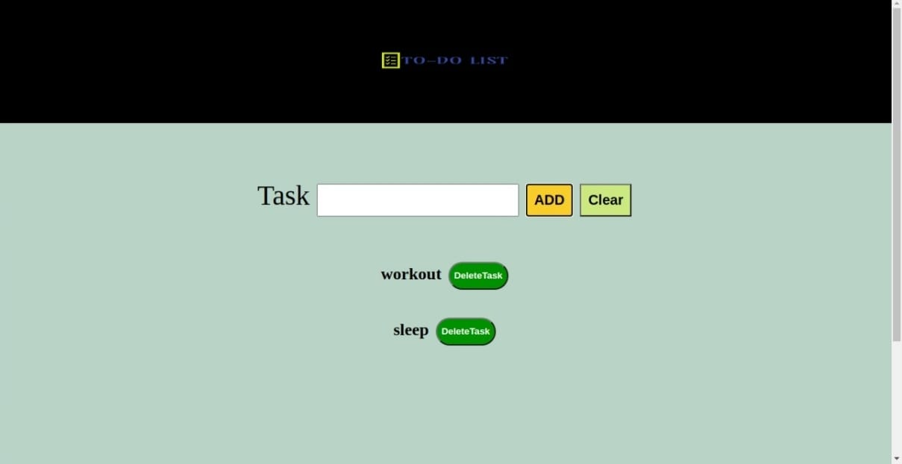

# TO-DO LIST

** To-Do List** is a project in which we add a task which is displayed on page and when task is done we can delete it from list.we have stored the data in localstorage so data is not lost when page is refreshed

Content

- **index.html**-this files contain basic markup with javascript and css file linked to it.
- **style.css**-this files contain all the style for clock watch navigation bar and footer.
- **src**-this is javascript folder in which we have created modules and are imported in main.js which is linked to html page

# DEMO

